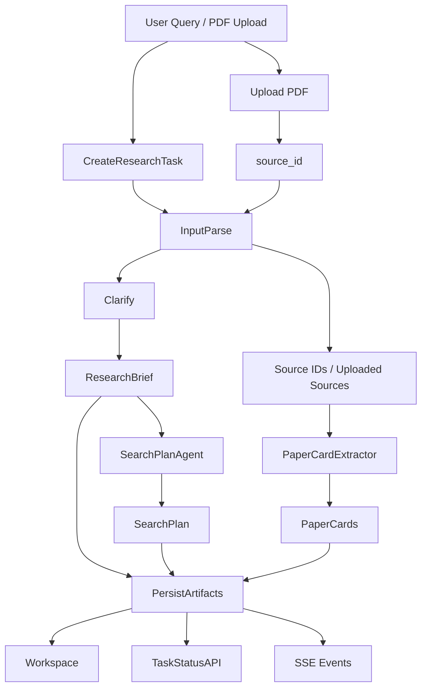

下面给出 **Phase 1 的完整设计**。
该设计遵循两条原则：

第一，**外层保留固定工作流作为控制平面**。当前仓库最成熟的是 `StateGraph` 编排、typed state、任务 API 与 SSE 链路，因此 Phase 1 不需要推翻主线，而是沿着现有任务流做 research task 化扩展。当前仓库的主入口已经是固定 11 节点 `StateGraph`，任务接口和前端状态面板也已成型，但工具调用能力和 planning 仍主要停留在旧 ReAct 路径。

第二，**只有满足 tool use、working memory、reflection、stop condition 的业务模块才定义为 agent**。因此：

* `Clarify`：固定结构化节点
* `SearchPlanAgent`：Phase 1 唯一真正的 agent
* `PaperCardExtractor`：schema-bound extractor / tool
* `PersistArtifacts`、`Workspace`、`TaskStatusAPI`、`SSE`：基础设施节点

这套拆法也对应当前仓库的真实短板：最弱的是 `Tool Calling / MCP`、`Planning`、`RAG`、`Observability / Trace`，而不是 workflow 编排本身。 

---

## 一、Phase 1 的目标与边界

### 目标

把系统从“单篇论文报告生成”升级为“可执行 research task 底座”，实现以下最小闭环：

* 接收用户 research query 与可选 PDF
* 创建 ResearchTask
* 标准化输入
* 生成结构化 `ResearchBrief`
* 生成可执行 `SearchPlan`
* 从上传或指定来源中抽取 `PaperCards`
* 将中间产物持久化到 `Workspace`
* 通过 `Task Status API` 和 `SSE` 对外暴露任务状态

### 不在 Phase 1 内的内容

* 完整综述写作
* reviewer 驱动的二轮补检索闭环
* comparison matrix 自动生成
* durable queue / 多 worker 调度
* 全量 MCP 生态接入
* 完整 regression/eval 平台

### 最终产物

* `ResearchTask`
* `Workspace`
* `Artifact`
* `ResearchBrief`
* `SearchPlan`
* `PaperCards`
* `Task status + SSE events`

---

## 二、总体架构

### 控制平面

外层采用固定 workflow 图，负责：

* 阶段切换
* 状态推进
* 失败中止
* artifact 持久化
* API/SSE 输出

### 业务平面

各业务阶段按真实复杂度拆分：

#### 1. Fixed structured node

* `InputParse`
* `Clarify`
* `PaperCardExtractor`
* `PersistArtifacts`
* `FormatOutput`

#### 2. True agent

* `SearchPlanAgent`

#### 3. Infrastructure

* `Tasking`
* `Workspace`
* `Uploads`
* `Tool Runtime / Registry`
* `TaskStatusAPI`
* `SSE`

---

## 三、Phase 1 的完整 workflow

### 主流程

```text
User Query / PDF Upload
  -> CreateResearchTask
  -> InputParse
  -> Clarify
  -> SearchPlanAgent
  -> PaperCardExtractor
  -> PersistArtifacts
  -> Workspace / TaskStatusAPI / SSE
```

### 各阶段输出关系

* `Clarify` 输出 `ResearchBrief`
* `SearchPlanAgent` 消费 `ResearchBrief`，输出 `SearchPlan`
* `PaperCardExtractor` 消费 `source_ids / uploaded PDF / extracted text`，输出 `PaperCards`
* `PersistArtifacts` 将上述产物写入 `Workspace`
* `TaskStatusAPI` 和 `SSE` 对外暴露状态和事件

---

## 四、节点级设计

## 4.1 User Query / PDF Upload

### 输入

* `query: str`
* 可选 `pdf file`
* 可选 `workspace_id`

### 输出

* `task_id`
* `workspace_id`
* `source_ids[]`

### 设计要求

当前前端 PDF 上传仍存在“走 `file.text()` 而非真实二进制上传”的问题，因此 Phase 1 必须补齐真正的文件上传链路。

### 接口

* `POST /api/v1/uploads/pdf`
* `POST /api/v1/research/tasks`

---

## 4.2 CreateResearchTask

### 定位

任务管理节点，不是 agent。

### 职责

* 分配 `task_id`
* 创建/绑定 `workspace_id`
* 初始化任务状态
* 写入任务存储
* 发出 `task_created` 事件

### 输出对象

```python
ResearchTask(
  task_id,
  workspace_id,
  status="queued",
  current_stage="input_parse",
  input_payload={...},
  warnings=[],
  error=None
)
```

### 模块

```text
src/tasking/models.py
src/tasking/manager.py
src/tasking/store.py
src/tasking/events.py
```

---

## 4.3 InputParse

### 定位

固定节点。

### 职责

* 标准化 query
* 标准化 `source_ids`
* 合并已有 `workspace_context`
* 写入统一的 `ResearchState.user_input`

### 输出

```python
{
  "user_input": {
    "query": "...",
    "workspace_id": "...",
    "source_ids": [...]
  },
  "uploaded_sources": [...],
  "current_stage": "input_parse"
}
```

### 模块

```text
src/research/graph/nodes/input_parse.py
```

---

## 4.4 Clarify

### 定位

固定结构化节点，不是 agent。

### 原因

该阶段只负责把模糊需求转换成结构化 `ResearchBrief`，不依赖 tool use、working memory、reflection。把它做成 schema-bound node 更符合当前系统边界，也更匹配当前仓库在结构化输出和 schema 方向上的基础能力。当前仓库已有 Pydantic/schema 设计基础，但 structured output 还不够硬，因此 Clarify 节点应优先走严格 schema 约束。

### 输入

* `raw_query`
* `workspace_context`
* `preferred_output`
* `uploaded_source_ids`

### 输出

`ResearchBrief`

* `topic`
* `goal`
* `desired_output`
* `sub_questions`
* `time_range`
* `domain_scope`
* `source_constraints`
* `focus_dimensions`
* `ambiguities`
* `needs_followup`
* `confidence`
* `schema_version="v1"`

### 模块

```text
src/research/agents/clarify_agent.py
src/research/prompts/clarify_prompt.py
src/research/policies/clarify_policy.py
src/research/graph/nodes/clarify.py
src/models/research.py
```

---

## 4.5 SearchPlanAgent

### 定位

Phase 1 唯一按完整 agent 模式实现的业务节点。

### Agent 判定标准

该模块必须同时满足：

* 目标驱动：从 `ResearchBrief` 产出可执行 `SearchPlan`
* tool use：调用轻量检索与 query 操作工具
* working memory：记录 query 尝试与命中情况
* reflection：识别 coverage gap、query 噪声、source 偏差并修正
* stopping：在预算或覆盖条件满足时停止

### 采用的设计模式

**ReAct + Reflection + Episodic Working Memory + Budgeted Tool Use**

### 目标

将 `ResearchBrief` 转换为：

* query groups
* source preferences
* dedup / rerank / stop conditions
* follow-up seeds
* planning warnings

### 工具集合

最小工具集：

* `search_arxiv(query, top_k)`
* `search_local_corpus(query, top_k)`
* `search_metadata_only(query, top_k)`
* `expand_keywords(topic, focus_dimension)`
* `rewrite_query(query, mode)`
* `merge_duplicate_queries(query_list)`
* `summarize_hits(results)`
* `estimate_subquestion_coverage(results, sub_questions)`
* `detect_sparse_or_noisy_queries(results)`

### Working memory

```python
class SearchPlannerMemory(BaseModel):
    attempted_queries: list[str]
    query_to_hits: dict[str, int]
    empty_queries: list[str]
    high_noise_queries: list[str]
    subquestion_coverage_map: dict[str, list[str]]
    source_usage_stats: dict[str, int]
    planner_reflections: list[str]
    iteration_count: int
    remaining_budget: int
```

### 执行循环

1. 初始化 broad/focused queries
2. 调工具做轻量观察
3. 更新工作记忆
4. 反思 coverage/noise/gaps
5. 改写/合并/扩展/收窄 queries
6. 判断停止条件
7. 输出 `SearchPlan`

### 输出对象

`SearchPlan`

* `plan_goal`
* `coverage_strategy`
* `query_groups`
* `source_preferences`
* `dedup_strategy`
* `rerank_required`
* `max_candidates_per_query`
* `requires_local_corpus`
* `coverage_notes`
* `planner_warnings`
* `followup_search_seeds`
* `followup_needed`
* `schema_version="v1"`

### 模块

```text
src/research/agents/search_plan_agent.py
src/research/prompts/search_plan_prompt.py
src/research/policies/search_plan_policy.py
src/research/graph/nodes/search_plan.py
src/tools/runtime.py
src/tools/registry.py
src/tools/specs.py
```

### 必要前置

当前仓库缺少统一 Tool Runtime，tool schema 仍是占位，因此 Phase 1 需要先引入最小 `ToolSpec + invoke()` 机制，把 planning 的工具调用统一化。

---

## 4.6 PaperCardExtractor

### 定位

明确为 extractor/tool，而不是 agent。

### 原因

该阶段的核心职责是“从 source 中抽取结构化信息”，不要求动态规划、多轮反思或工具使用闭环，更适合采用 **schema-bound extraction**。当前仓库在 Pydantic/schema 设计上基础较好，适合作为 extractor 的落地点。

### 输入

* `source_id`
* `document_text`
* 可选 `ResearchBrief` 作为抽取上下文

### 输出

`PaperCard`

* `title`
* `authors`
* `year`
* `venue`
* `problem`
* `method`
* `datasets`
* `metrics`
* `contributions`
* `limitations`
* `evidence_spans`
* `source_id`

### 设计要求

* 严格 schema 输出
* 支持 repair / fallback
* 不包含 agent loop
* 不直接检索外部论文，只处理当前 source

### 模块

```text
src/research/extractors/paper_card_extractor.py
src/research/prompts/paper_card_prompt.py
src/models/paper.py
src/research/graph/nodes/paper_card.py
```

---

## 4.7 PersistArtifacts

### 定位

基础设施节点。

### 输入

* `ResearchBrief`
* `SearchPlan`
* `PaperCards`
* 任务上下文

### 职责

* 写入 workspace
* 生成 artifact refs
* 更新任务状态
* 发出 artifact 事件

### Artifact 类型

* `brief`
* `search_plan`
* `paper_card`
* `upload`
* `task_log`

### 模块

```text
src/workspace/models.py
src/workspace/service.py
src/workspace/repository.py
src/research/graph/nodes/persist_artifacts.py
```

---

## 4.8 Workspace / TaskStatusAPI / SSE

### Workspace

作为长期工作区，保存任务产物，而不是“对话记忆”。

### TaskStatusAPI

返回：

* `status`
* `current_stage`
* `warnings`
* `artifacts`
* `node_statuses`

当前 SSE 和状态面板仍偏基础，`NodeStatus`/trace 尚未真正系统接线，因此 Phase 1 至少要求在 `/tasks/{id}` 里直接返回更真实的阶段状态。

### SSE

建议事件类型：

* `task_created`
* `node_started`
* `tool_called`
* `node_finished`
* `artifact_saved`
* `warning`
* `task_completed`
* `task_failed`

---

## 五、统一状态模型

```python
class ResearchState(BaseModel):
    task_id: str
    workspace_id: str
    user_input: dict
    uploaded_sources: list[str] = []
    brief: ResearchBrief | None = None
    search_plan: SearchPlan | None = None
    paper_cards: list[PaperCard] = []
    artifacts: list[ArtifactRef] = []
    warnings: list[str] = []
    current_stage: str = "created"
    error: str | None = None
```

---

## 六、核心对象设计

### ResearchTask

```python
class ResearchTask(BaseModel):
    task_id: str
    workspace_id: str
    status: str
    current_stage: str
    input_payload: dict
    created_at: datetime
    updated_at: datetime
    warnings: list[str] = []
    error: str | None = None
```

### Workspace

```python
class Workspace(BaseModel):
    workspace_id: str
    name: str
    owner: str | None = None
    created_at: datetime
```

### Artifact

```python
class Artifact(BaseModel):
    artifact_id: str
    workspace_id: str
    task_id: str
    artifact_type: str
    uri_or_path: str
    metadata: dict = {}
    created_at: datetime
```

---

## 七、API 设计

### 1. 上传 PDF

`POST /api/v1/uploads/pdf`

返回：

```json
{
  "source_id": "src_pdf_001",
  "workspace_id": "ws_001",
  "filename": "paper.pdf"
}
```

### 2. 创建 research task

`POST /api/v1/research/tasks`

请求：

```json
{
  "query": "最近多模态医学报告生成方向有哪些可借鉴方法？",
  "workspace_id": "ws_001",
  "source_ids": ["src_pdf_001"]
}
```

返回：

```json
{
  "task_id": "rt_001",
  "workspace_id": "ws_001",
  "status": "queued"
}
```

### 3. 查询任务

`GET /api/v1/research/tasks/{task_id}`

### 4. SSE 事件流

`GET /api/v1/research/tasks/{task_id}/events`

### 5. 查询 workspace artifacts

`GET /api/v1/workspaces/{workspace_id}/artifacts`


---

## 八、Phase 1 的 flowchart



---

## 九、已实现清单（实现状态）

### 9.1 后端模块

| 模块 | 文件路径 | 状态 | 说明 |
|------|---------|------|------|
| ResearchGraph Builder | `src/research/graph/builder.py` | ✅ 完整 | clarify → search_plan → END |
| Clarify Node | `src/research/graph/nodes/clarify.py` | ✅ 完整 | ResearchBrief 生成 |
| Clarify Agent | `src/research/agents/clarify_agent.py` | ✅ 完整 | LLM + policy |
| Clarify Prompt | `src/research/prompts/clarify_prompt.py` | ✅ 完整 | 独立 prompt 模块 |
| Clarify Policy | `src/research/policies/clarify_policy.py` | ✅ 完整 | 校验 + fallback |
| SearchPlan Agent | `src/research/agents/search_plan_agent.py` | ✅ 完整 | Agent 循环 + 工具调用 + 记忆 |
| SearchPlan Prompt | `src/research/prompts/search_plan_prompt.py` | ✅ 完整 | system + few-shot + reflection |
| SearchPlan Policy | `src/research/policies/search_plan_policy.py` | ✅ 完整 | 停止条件 + fallback |
| SearchPlan Node | `src/research/graph/nodes/search_plan.py` | ✅ 完整 | LangGraph node 封装 |
| Research Models | `src/models/research.py` | ✅ 完整 | SearchPlan + Memory + ResearchState |
| DB Engine | `src/db/engine.py` | ✅ 完整 | PostgreSQL + SQLAlchemy 2.0 |
| DB Models | `src/db/models.py` | ✅ 完整 | documents + chunks + vector_chunks |
| MetaDB | `src/ingest/db.py` | ✅ 完整 | SQLAlchemy ORM 兼容旧接口 |
| HybridSearcher | `src/retrieval/search.py` | ✅ 完整 | PostgreSQL BM25 + FAISS |
| Tool Specs | `src/tools/specs.py` | ✅ 完整 | ToolSpec schema |
| Tool Registry | `src/tools/registry.py` | ✅ 完整 | ToolRuntime 单例 |
| Search Tools | `src/tools/search_tools.py` | ✅ 完整 | 9 个 planning 工具 |
| Tool `__init__` | `src/tools/__init__.py` | ✅ 完整 | 统一导出 |
| Task API | `src/api/routes/tasks.py` | ✅ 完整 | 支持 research mode |
| App | `src/api/app.py` | ✅ 完整 | FastAPI + CORS |
| Settings | `src/agent/settings.py` | ✅ 完整 | DATABASE_URL + SEARXNG_BASE_URL |

### 9.2 前端模块

| 模块 | 文件路径 | 状态 | 说明 |
|------|---------|------|------|
| App 入口 | `frontend/src/App.tsx` | ⏳ 待更新 | 需支持 research mode |
| 任务提交表单 | `frontend/src/components/TaskSubmitForm.tsx` | ⏳ 待更新 | 需添加 research 模式 |
| 类型定义 | `frontend/src/types/task.ts` | ⏳ 待更新 | 需添加 research 接口 |
| SSE Hook | `frontend/src/hooks/useTaskSSE.ts` | ⏳ 待更新 | 需支持 research 事件 |
| GraphView | `frontend/src/components/GraphView.tsx` | ⏳ 待更新 | 需支持 research graph |
| ProgressBar | `frontend/src/components/ProgressBar.tsx` | ⏳ 待更新 | 需切换 report/research |
| ReportPreview | `frontend/src/components/ReportPreview.tsx` | ⏳ 待更新 | 需显示 brief + search_plan |
| MarkdownRenderer | `frontend/src/components/MarkdownRenderer.tsx` | ✅ 已有 | 复用 |

### 9.3 环境与基础设施

| 依赖 | 状态 | 说明 |
|------|------|------|
| PostgreSQL | ✅ 已就绪 | `researchagent` 数据库 + `researchuser` 角色 |
| SearXNG Docker | ✅ 已就绪 | JSON API 可用，`engines=arxiv` 正常工作 |
| .env 配置 | ✅ 已就绪 | DATABASE_URL + SEARXNG_BASE_URL 已写入 |
| DB 建表 | ✅ 已验证 | `documents`、`chunks`、`vector_chunks` 三张表已创建 |
| pgvector | ⏳ 可选 | 未安装，向量检索降级为纯 BM25 |
| FAISS 索引 | ⏳ 待构建 | ingestion 流程完成后生成 |

---

## 十、API 清单（已实现）

### 10.1 任务管理 API

#### `POST /tasks`
创建报告或研究任务。

**Request（报告模式，source_type=arxiv）**
```json
{
  "input_type": "arxiv",
  "input_value": "1706.03762",
  "report_mode": "draft",
  "source_type": "arxiv"
}
```

**Request（研究模式，source_type=research）**
```json
{
  "input_type": "arxiv",
  "input_value": "最近多模态大模型在医学影像诊断方向有哪些进展？",
  "report_mode": "draft",
  "source_type": "research"
}
```

**Response**
```json
{
  "task_id": "rt_abc123",
  "status": "pending"
}
```

---

#### `GET /tasks/{task_id}`
查询任务状态和结果。

**Response（research 模式完成时）**
```json
{
  "task_id": "rt_abc123",
  "status": "completed",
  "created_at": "2026-04-07T12:00:00Z",
  "completed_at": "2026-04-07T12:01:30Z",
  "source_type": "research",
  "report_mode": "draft",
  "result_markdown": "{ ...brief JSON... }",
  "error": null
}
```

**Response（报告模式完成时）**
```json
{
  "task_id": "rt_abc123",
  "status": "completed",
  "paper_type": "regular",
  "draft_markdown": "## ...报告正文...",
  "full_markdown": null,
  "followup_hints": ["建议深入阅读第3节方法细节"],
  "chat_history": []
}
```

---

#### `GET /tasks/{task_id}/events`
SSE 事件流。

**事件类型**

| type | 字段 | 说明 |
|------|------|------|
| `status_change` | `status` | 状态变更：pending → running → completed/failed |
| `node_start` | `node` | 节点开始执行 |
| `node_end` | `node`, `duration_ms`, `warnings` | 节点执行结束 |
| `thinking` | `node`, `content` | 节点推理过程（可选） |
| `done` | `status` | 任务结束标记 |

**research 模式下节点事件**

| 节点名 | 说明 |
|--------|------|
| `clarify` | ClarifyAgent 执行 |
| `search_plan` | SearchPlanAgent 执行 |

**report 模式下节点事件**（11 节点）

`input_parse` → `ingest_source` → `extract_document_text` → `normalize_metadata` → `retrieve_evidence` → `classify_paper_type` →（三路分支）→ `resolve_citations` → `verify_claims` → `apply_policy` → `format_output`

---

#### `GET /tasks`
列出所有任务（简要）。

---

#### `POST /tasks/{task_id}/chat`
任务完成后追加对话（仅报告模式）。

---

### 10.2 直接报告 API

#### `POST /report`
通过 ReAct Agent 直接生成单篇论文报告（绕过 StateGraph）。

```json
{ "arxiv_url_or_id": "1706.03762" }
```

#### `POST /report/upload_pdf`
上传 PDF 并生成报告（真实二进制上传）。

---

## 十一、前端集成说明（待实现）

### 11.1 任务模式区分

前端通过 `source_type` 字段区分两种工作流：

| 模式 | source_type | 工作流 | Graph 节点 | 结果字段 |
|------|------------|--------|-----------|---------|
| 报告模式 | `arxiv` / `pdf` | 11 节点 ReportGraph | 见上方节点列表 | `draft_markdown` / `full_markdown` |
| 研究模式 | `research` | ResearchGraph | `clarify` + `search_plan` | `result_markdown`（brief JSON） |

### 11.2 Research 模式下 GraphView 渲染

需要切换两套节点布局：

```typescript
const REPORT_NODES = ['input_parse', 'ingest_source', ...];
const RESEARCH_NODES = ['clarify', 'search_plan'];  // Phase 1

// useTaskSSE 需判断 task.source_type，返回对应的节点列表
```

### 11.3 Research 模式下 ReportPreview 展示

`result_markdown` 在 research 模式下是 JSON 格式的 `ResearchBrief`（包含 `topic`、`sub_questions`、`ambiguities` 等字段）。

Phase 1 可直接渲染为格式化的 JSON 预览；后续扩展为独立研究简报 UI。

### 11.4 进度条

Research 模式仅有 2 个节点（clarify + search_plan），进度计算：
```
clarify done  →  50%
search_plan done → 100%
```

---

## 十二、完成标准（更新版）

Phase 1 完成的判定条件（截至当前实现）：

| # | 条件 | 状态 |
|---|------|------|
| 1 | 支持 `source_type=research` 的任务创建 | ✅ |
| 2 | 支持真实二进制 PDF 上传（`/report/upload_pdf`） | ✅ |
| 3 | `Clarify` 输出合法 `ResearchBrief` JSON | ✅ |
| 4 | `SearchPlanAgent` 以真实 Agent 循环运行，输出合法 `SearchPlan` JSON | ✅ |
| 5 | `SearchPlanAgent` 调用工具（真实 HTTP）而非纯 LLM | ✅ |
| 6 | `SearchPlanAgent` 有 WorkingMemory 和反思循环 | ✅ |
| 7 | `SearchPlanAgent` 有停止条件（budget + 覆盖充分） | ✅ |
| 8 | 两套 Graph（report / research）均可通过 `source_type` 路由 | ✅ |
| 9 | `/tasks/{id}` 和 `/events` 返回真实阶段推进 | ✅ |
| 10 | PostgreSQL 三张表已创建，连接正常 | ✅ |
| 11 | SearXNG JSON API 正常工作（`engines=arxiv`） | ✅ |
| 12 | 工具通过 Tool Runtime（`@tool` + `ToolRuntime`）统一接入 | ✅ |
| 13 | 前端支持 research 模式提交与展示 | ⏳ 待实现 |
| 14 | 前端 GraphView 支持 research graph 渲染 | ⏳ 待实现 |
| 15 | 前端 SSE 支持 research 事件解析 | ⏳ 待实现 |

---

## 十三、Phase 1 之后的下一步

| 优先级 | 任务 | 说明 |
|--------|------|------|
| P0 | 前端集成（本文档十一） | 让 research 模式可在 UI 中使用 |
| P1 | PaperCardExtractor | 从上传 PDF 中抽取 PaperCard |
| P1 | Workspace / Artifact 持久化 | 将 brief + search_plan 写入数据库 |
| P2 | `search_local_corpus` 完善 | 构建 FAISS 索引，支持本地 PDF 语义检索 |
| P2 | pgvector 向量检索 | 可选，向量维度需与 embedding 模型对齐 |
| P3 | Reviewer 驱动的二轮补检索 | 根据报告反馈补充搜索 |
| P3 | 完整综述写作节点 | Draft Report + Full Report |

---

## 十四、flowchart（完整版）

```mermaid
flowchart TD

    subgraph Input["输入层"]
        A[User Query / arXiv ID]
        PDF[Upload PDF]
    end

    subgraph Task["CreateResearchTask"]
        B[分配 task_id]
    end

    A --> B
    PDF --> B

    B --> C{source_type}

    C -->|arxiv| D[ReportGraph: 11节点]
    C -->|pdf| D
    C -->|research| E[ResearchGraph]

    subgraph ReportGraph["ReportGraph（报告模式）"]
        D1[input_parse]
        D2[ingest_source]
        D3[extract_document_text]
        D4[normalize_metadata]
        D5[retrieve_evidence]
        D6[classify_paper_type]
        D7[draft_report]
        D8[report_frame]
        D9[survey_intro_outline]
        D10[repair_report]
        D11[resolve_citations]
        D12[verify_claims]
        D13[apply_policy]
        D14[format_output]
        D1-->D2-->D3-->D4-->D5-->D6
        D6-->D7 & D8 & D9
        D7-->D10-->D11
        D8-->D11
        D9-->D11
        D11-->D12-->D13-->D14
    end

    subgraph ResearchGraph["ResearchGraph（研究模式）"]
        R1[clarify]
        R2[search_plan]
        R1-->R2
    end

    D14 --> OutReport[/tasks/{id} + SSE/]
    R2 --> OutResearch[/tasks/{id} + SSE/]

    subgraph Output["输出"]
        OutReport[result_markdown / draft_markdown]
        OutResearch[brief JSON + search_plan JSON]
    end
```

---

**本文档版本**：v2（2026-04-07）
**已实现节点**：Clarify、SearchPlanAgent（Agent 循环）、ReportGraph（11 节点）
**待实现**：PaperCardExtractor、Workspace 持久化、前端集成
